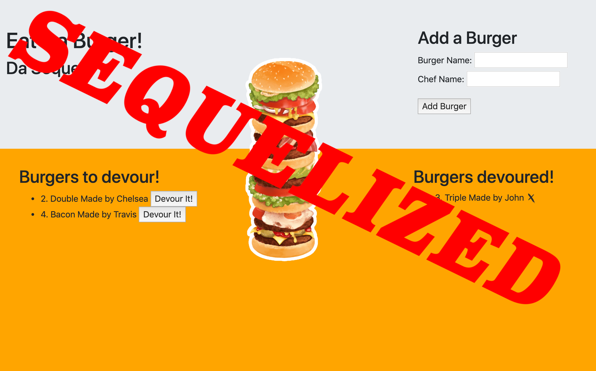

# Burger 2: The Sequel

### Overview

In this assignment, I am going to Sequelize the `Burger` app I made last unit. I've split this exercise into three different tiers, all with different tasks and expectations. 

#### Tier 1: Sequelized! (Basic to Moderate)

* Remove all references to your vanilla MySQL queries and replace them with Sequelize queries.

* That means:

  * Replacing your MySQL `Burger` model with a Sequelized equivalent.

    * Don't forget to edit the model and initial migration file to make the burger's devoured field carry a default value of false -- otherwise you might encounter bugs.
      * There's no option to include that default in the command line, so you'll need to open up your editor to make this change.
    * Don't forget to sync the models!

    * Edit your new `config.json` file to include your database configurations. Place your JawsDB details in the `production` property of your json file; the details of your local database go in the `developer` property.

    * Remove your old ORM file, as well as any references to it in `burgers_controller.js`. Replace those references with Sequelize's ORM methods.

#### Tier 2: Customer Associations (Challenge)

* Add in a Customer association to the project. This will involve creating at least one new Customer model and connecting it with your Burger model.

* What kind of association you would like to use is up to you. Does a Customer have one Burger? Many Burgers?

* For example, you could make a site that logs the name of which Customer ate which Burger, where each Customer only gets one Burger. If you can't think of another type of association, try this one!

* If you do go select this tier, you must edit the handlebars files and CSS stylesheets to implement some sort of additional feature to the site. We don't want you to just connect two models and submit your project. Make your site do something relevant to this association.

#### Bonus! (Challenge)

* Add validations to your models where:

  * A burger's name cannot be null
  * A burger's devoured status is false by default
  * A Customer's name cannot be null

* Order the Burgers you send back to the user in alphabetical order using the Sequelize "order" option.

### Technologies Used

* HTML
* CSS
* JavaScript
* Node.js
* MySQL
* Express
* Handlebars
* Sequelize

### Sequelize Da Burger Links

[Sequelize-Da-Burger Heroku](https://eat-da-burger-sickels.herokuapp.com/)

**Thanks for stopping by!**
